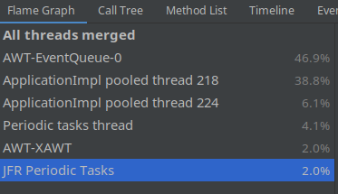
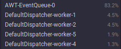
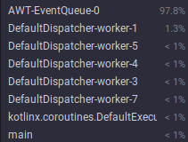
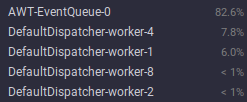

# Projekt nr 1 - generator ewolucyjny

## Dookreślenia do części wymagań

- Projekt przygotowany w Kotlin oraz "Compose Multiplatform, by JetBrains"
- Po zatrzymaniu programu można wskazać zwierzę najeżdżając na nie kursorem,
nie klikając w nie
- Statystyki są zapisywane automatycznie do plików, gdy symulacja nie jest włączona
(pauza lub całkowite zatrzymanie)
- Zwierząt na początku jest wartością zależną od szerokości i wysokości [^1].
- Dominantę z genotypu rozumiem przez genotyp, którego liczebność jest największa oraz jest większa od 1.
W przypadku większej ilości genotypów o największej liczebności wybierany jest losowy.

## Braki

- Brak wykresów
- Legenda która jest lekko ukryta
- Brak wskazania zwierząt z dominującym genomem

## Sprostowanie

W tej części chciałbym się skupić na tym dlaczego części wymagań nie ma lub są utrudnione do wykonania z użytymi narzędziami.
Zaczynając od części `backendowej`, która nie wymagała GUI Kotlin sprawdza się o wiele lepiej niż prezentowana zazwyczaj Java. Zastosowanie method overloading czy extension functions jest wręcz zalecane. Wzorzec Observer realizowany na funkcjach zamiast na obiektach pozwala na większą kontrolę nad takimi funkcjami i ich delegowaniem do zmiennych.

Jednak problemy zaczynają się, gdy stworzy się GUI przy pomocy dedykowanych rozwiązań.
Blibliotekę, którą wybrałem do tworzenia tego projektu była Compose-jb.

Ogólne porównanie wydajności JavaFX oraz Compose-jb w tym projekcie przy pomocy Java Flight Recorder

### JavaFX

Jak widać JavaFX jest bardziej zróżnicowana i wątek dotyczący symulacji wykorzystuje około 40%, gdy GUI zajmuje poniżej 50%.

### Compose-jb

W Compose-jb sytuacja wygląda zupełnie inaczej, wątek dotyczący symulacji zazwyczaj zajmuje poniżej 10%, gdy GUI zajmuje około **80-90%** całego czasu aplikacji. Tutaj worker-1 odpowiada za 1 symulacje, a worker-2 za druga symulację

Pokazuje to jedynie różnicę w rozkładzie wątków w aplikacji. Nie może być to potraktowane jako porównanie wydajności jako takiej, ale jedynie rozkład pracy procesora.

### Deklaratywne UI

Taki sposób zapisu UI pozwala na przyspieszone tworzenie reużywalnego UI, które jest aktualizowane (w dół drzewa) przy każdej zmianie stanu danej zmiennej.
Zmienne te to `MutableState`, zmienne które są thread-safe oraz same informaują UI oraz wątek z nim związany o swojej zmianie. Zmiennych takich używam do wszystkiego co nie jest stałe w UI, zatem nawet to czy widać ekran startowy czy symulacje jest zawarte w zmiennej o takim typie.
Pomaga to w prostych zmianach UI, np dodanie textu, lub przycisku zależnie od danej symulacji lub stanu.

Niestety taki zapis nie jest przystosowany do częstej zmiany stanu zmiennych, która powoduję rekompozycję części aplikacji. Dla przykładu można spojrzeć na mapę.
Jeżeli zmiana stanu dotyczy pojedynczego kwadratu, przy globalnej zmianie stanu zmiennej dotyczącej tej pozycji rekompozycji zostanie poddana cała mapa.

#### Przykładowy rozkład złego updateowania zmiennych

Dużym problemem jest także brak możliwości dodania elementów dynamicznie przy pomocy imperatywnego paradygmatu.
Na przykład dodanie tabeli zawierających wiele danych nie jest możliwe za pomocą dodania ich dynamicznie zależnie od końca epokim tylko jako dodanie elementu do listy (`MutableStateList`).

### Wykresy

Biblioteka ta w wersji 1.0.0 nie posiada możliwości dodania wykresów natywnych w Kotlinie.
Nie pozwala to dodać wykresów do zadania, lecz zamiast tego rozwiązania zostały dodane tabele obrazujące dane liczbowe na przestrzeni epok.
Jednak dodanie ich powoduje duże spadki wydajności:

#### Java Flight Profiler z tabelami

#### Java Flight Profiler bez tabel

Jeżeli przyjmiemy, że wykonana ilość taktów dla obu symulacji jest taka sama to widać, że po dodaniu tej funkcjonalności, aplikacja tworzy jedną iterację w czasię o 53% dłuższym.
Jest to spowodowane użyciem listy do renderowania listy na ekranie. Wszystkie dane, które zawiera tabela muszą być przechowane w formie thread-safe listy co spowalnia dodawania oraz czytanie.

### Podsumowanie

Wymienione wyżej argumenty pokazują, że Compose nie jest odpowiednią biblioteką do zastosowania w projekcie nr 1.
Częsta zmiana elementów UI nie sprzyja szybkości wykonania.

[^1]: Jest to obliczane wg wzoru `szerokosc * wysokosc * 0.3`. Nie jest spełniony warunek o minimalnej ilości równej 10.
