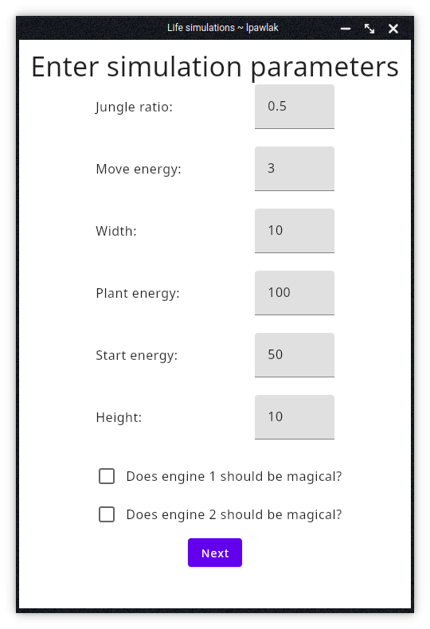
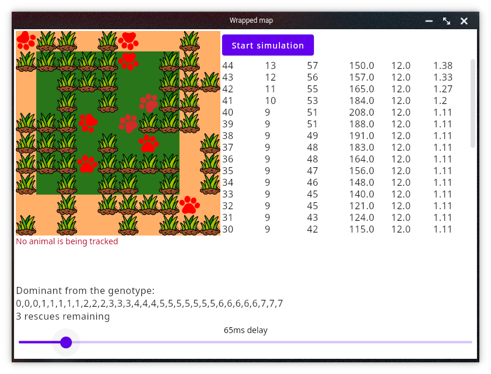
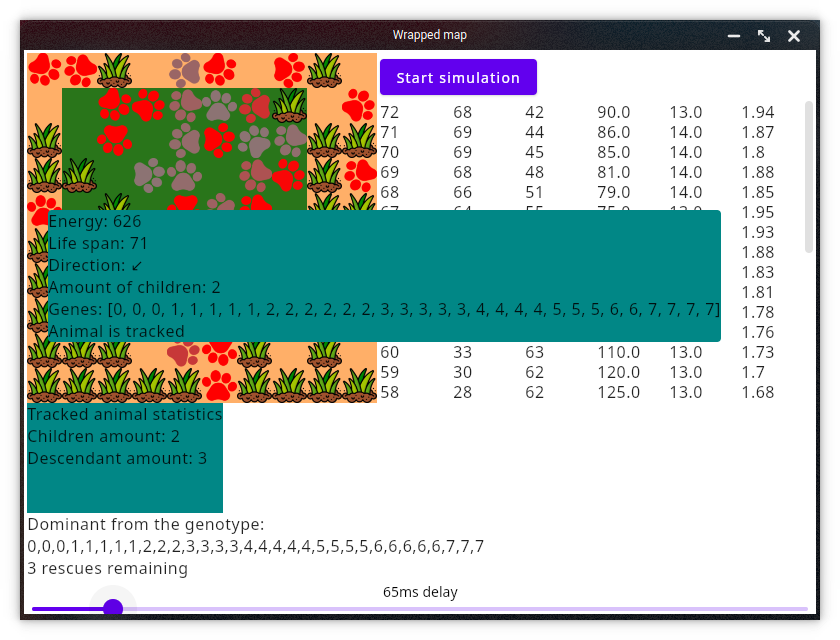

# Project 1 for object oriented programming course on AGH UST

## Evolution Simulator

### Story

Project that shows how animals, generation by generation, struggle to survive, eat vegies, reproduce
and how genes go along.



From very first screen you can choose what amounts the animal can get of life at beggining, how much can he earn from eating.
Other option is about a simulation engine as theres' two of them. One will try to revive civilization: when 5 animals are on the map, it will put another 5 with matching genes.


Then you have walled and wrapped map in first animals stop at borders and at wrapped animals go on the other side of the map when try to pass the border.
You can speed up or slow down simulation, it automatically saves statistics from table to csv file once you quit or stop simulation.

You can also choose one of animals and track how he is doing at the specific moment.


### More technically

Projects have been made with Kotlin and JP-Compose. 

It can be run with 

```./gradlew run```

Done in 2021 ~ lpawlak1
